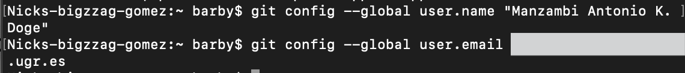
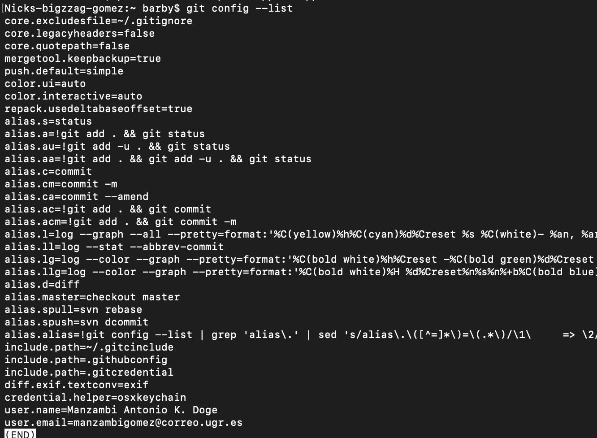

## Configuracion del Nombre y Correo.. GIT
  
  Aqui yo configure el nombre, el correo de acesso a mi github, etc.. usando el comando git config --global definiendo el nombre y el correo
  
  
  
  En seguida Hicimos un Listado para comprobar que los datos se han grabdo correctamente.
  
  
  
  como podemos ver las dos ultimas filas compraban los datos armacenados
