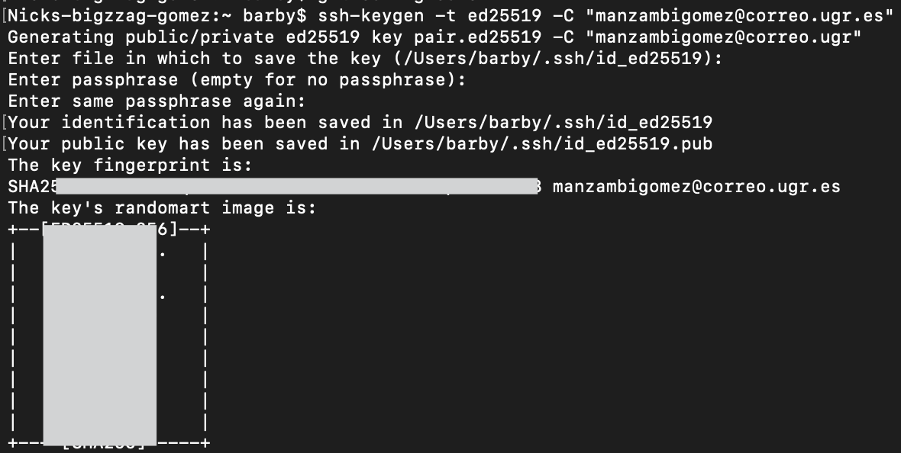
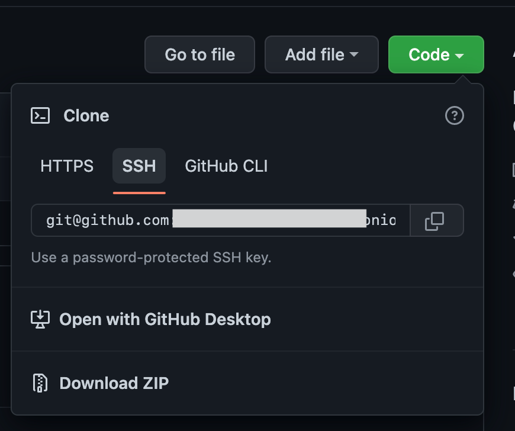
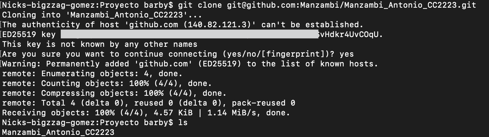

## Generando una Clave SSH
 
  Para Generar nueva clase usamos ssh-keygen -t ed25519 -C "Man******@correo.ugr.es".
  

En la primera fila podemos visualizar el codigo y en seguida la generacion del mismo.
En la fila 2 Generating public/private ed25519 key pair,  Esto crea una nueva clave SSH, 
utilizando el correo electrónico proporcionado como etiqueta.

despues de la creacion procedemos hacer la clonacion de nuestro repositorio usando el codigo SSH, como se ve en la figura

Una vez que hayamo hecho eso, usamos el comando git clone para hacer el clone de nuestro repositorio como se ve abajo

Estos procedimientos son solo un resumen de esta configuracion....
