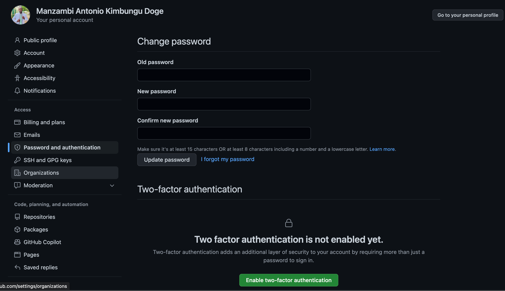
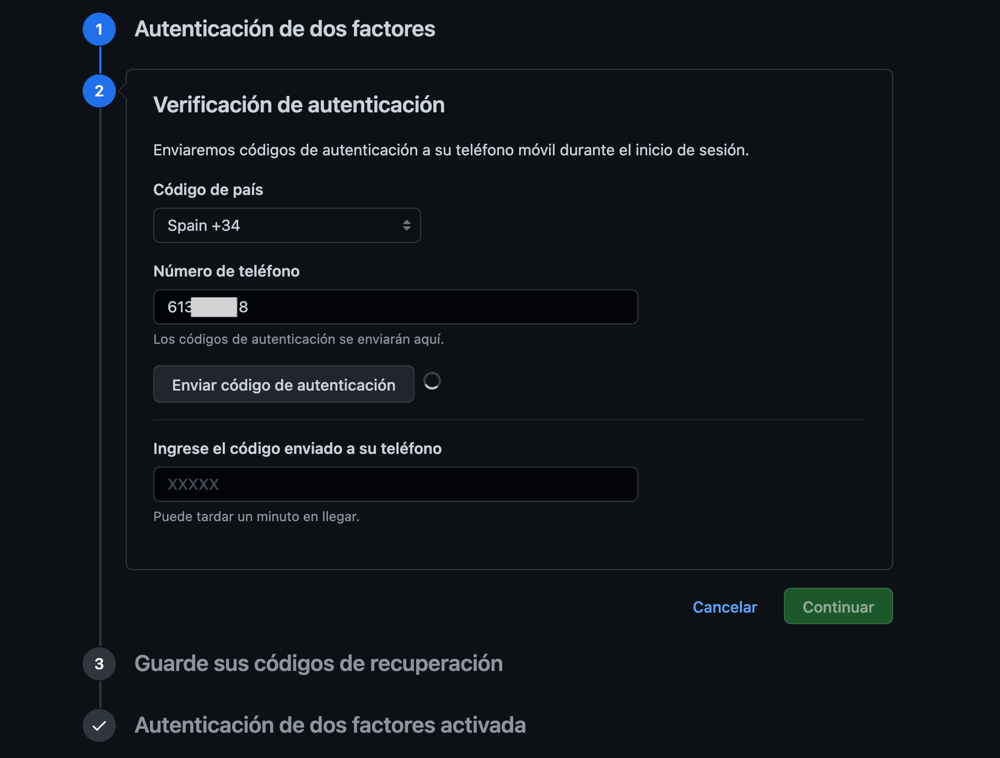

## Factor de Doble Autentificacion

Aqui el primero paso es ir a nuestro icone donde tiene nuestra foto del perfil en el canto 
 superior derecho, haciendo click sobre ella, ir a ajustes, una ves presionado nos sale 
 lo que se ven en el image de abajo

En seguida nos dirigimos hasta el boton verde que se encuentra en el rodate de la pagina y lo presionamos.
Una vez que hayamos hecho eso, nos sale la ventanilla para rellenar nuestros datos, para la posterior confirmacion.

 
  
  Una vez que nos envian el Codigo Rellenamos presionamos en continuar, hasta concluir el proceso.
