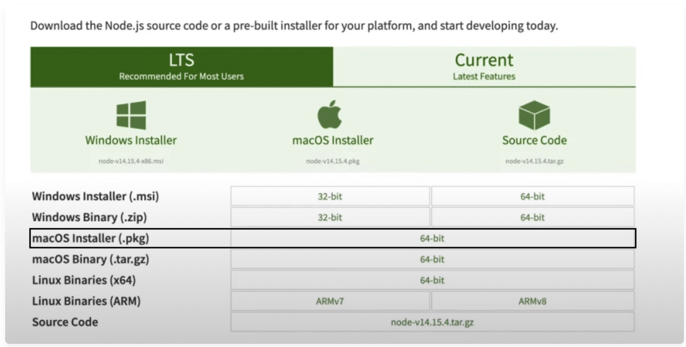
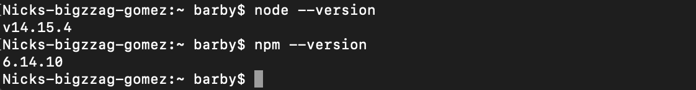

## 💻  hito 2  📌  

  ### 🌝 Bien Venido al hito2 🔥 
  
## Breves consideraciones

Este proyecto se generó con [Angular CLI](https://github.com/angular/angular-cli) versión 11.0.4.
lo que se ve a continuacion es solo una parte de explicacion del proyecto, la parte del front, con un enlance del codigo al final.

### 🔄 Development server 💻 

Ejecute `ng serve` para un servidor de desarrollo. Navegue a `http://localhost:4200/`. La aplicación se recargará automáticamente si cambia alguno de los archivos de origen.

### 📈☣️ Code scaffolding 📑 📉  

Ejecute `ng generar componente nombre-componente` para generar un nuevo componente. También puede usar `ng generar directiva|tubería|servicio|clase|guardia|interfaz|enum|módulo`.

### ⏏️ Build 💥 

Ejecute `ng build` para compilar el proyecto. Los artefactos de compilación se almacenarán en el directorio `dist/`. Use el indicador `--prod` para una compilación de producción.

### ⚛️ Running unit tests 💣 

Ejecute `ng test` para ejecutar las pruebas unitarias a través de [Karma](https://karma-runner.github.io).

### 🔜 Running end-to-end tests 🔜 

Ejecute `ng e2e` para ejecutar las pruebas de extremo a extremo mediante [Transportador](http://www.protractortest.org/).

### Further help 🔀 

Para obtener más ayuda sobre Angular CLI, use `ng help` o consulte la página [Descripción general y referencia de comandos de Angular CLI] (https://angular.io/cli).

[traduzccion y parte del codigo](https://github.com/Manzambi/Manzambi_Antonio_CC2223/tree/main/Docs/Hito%202/MyAplication__CC/pizzaHut)

## ♾️ Infrastructure and project tests ♾️

En este apartado añadimos tests y una descripción inicial del entorno o infraestructura de la aplicación, donde se concretan los gestores de dependencias y tareas. Para la adición de tests, se necesita una biblioteca de aserciones y marco de pruebas, ambos añadidos también en este apartado.

En la Actualidad Existen varios Framworks de Pruebas muchos de ellos ya incluen bibliotecas de aserciones, para este proyecto estamos usando el liguagen typescript dentro del marco del framwork Angular, para el frontend, eso con la intuicion de crear una simulacion en la parte del cliente, y para el backend, crearemos una api con el nodeJs, usando el framework express, donde haremos el manejo de nuestra informacion. hasta el momento no vamos vamos a implementar una base de datos(eso sera mas para adelante). 🔥 

### :electron:  Choice and configuration of the package manager and dependency
   
  Para el gestor de Paquetes y depencia usaremos `NPM`. ℹ️ `NPM` es el sistema de gestión de paquetes por defecto para Node.js, un entorno de ejecución para JavaScrip 
  Para utilizar el comando `NPM` tenemos que descargar node primero. `nodejs` es el entorno que nos brindara el gestor `NPM`. para eso procedemos del seguiente modo.
    

Una vez descargada Lo instalamos. El paso de la instalacion de nodejs s super sencilla on esto basta seguir la sequencia de Next hasta concluir el proceso.

una vez Concluida el proceso hicimos `node --version` este comando nos dira la version del node, y `npm --version` la version npm.

una vez instalado nuestros gestores, procedemos a la instalacion de Expressjs. Pero antes nos movemos en la carpeta que pretendemos desarrollar nuestra api, y ejecutamos `npm init --yes` peste comando nos creara el [paquete.json](https://github.com/Manzambi/Manzambi_Antonio_CC2223/blob/main/Docs/Hito%202/MyAplication__CC/ApiRest/package.json) en ellas estaran algunas configuraciones utiles para nuestro proyecto, una vez hecho eso procedemos a ejecutar  `npm install express -E` para la instalacion de express que sera  nuestro framwork rest.

essas son la herramientas usadas, para el avance de los testes hicimos simulacion con los datos json de nuestra api usando postman, usando `npm run dev` o `node index.js` en este caso el [index.js](https://github.com/Manzambi/Manzambi_Antonio_CC2223/blob/main/Docs/Hito%202/MyAplication__CC/ApiRest/index.js) es el nombre de nuestro ficheiro que posee los JSON. esto es para visualizacion. una vez ejecutado el comando, apartir de postman usando nuestro servidor local, podemos visualizar estos datos.

