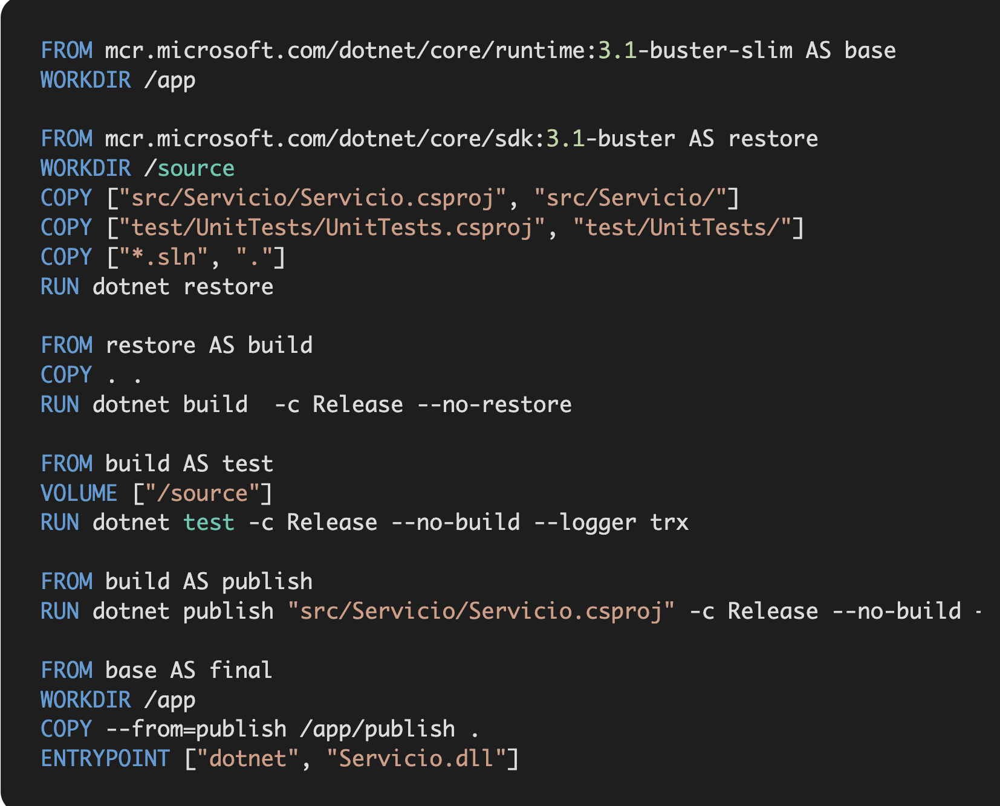
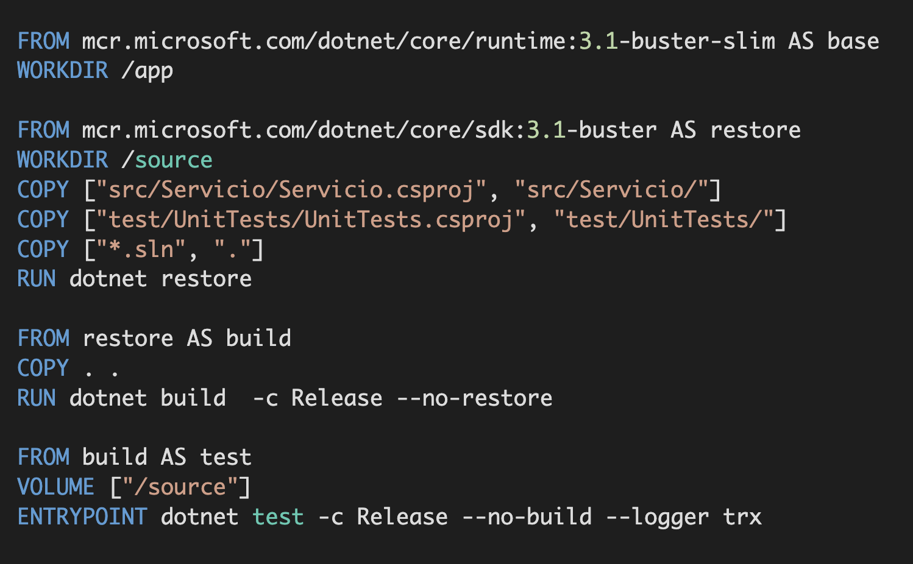
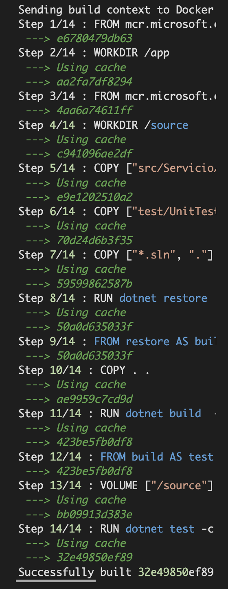

#  🥉 Hito 3 🥉

  🔥 Bien Venido a hito 3 🔥
   
   - - -- - -- - - - - -- - - - --  - - -- - -- - - - - -- - - - --   - - -- - -- - - - - -- - - - --   - - -- - -- - - - - -- - - - --  

## ♑ Pruebas de código dentro de contenedores Docker 🧪

Por un lado, todo proyecto que desarrollemos debería ir acompañado de sus pruebas de código para asegurar la calidad, hasta aquí todo bien. 
Por otro lado, Docker nos facilita la vida al poder tener todo dentro de nuestro contenedor y no necesitar en nuestra máquina nada más que 
el propio Docker.

Si estamos trabajando sin Docker, esto es muy sencillo ya que tenemos acceso total sobre todos esos elementos generados como pueden ser los reportes, 
aquí no hay fallo.

Por el contrario, si estamos trabajando con Docker y no necesitamos recolectar ninguno de estos elementos, el proceso también es sencillo, basta 
con añadir un stage en el Dockerfile que ejecute las pruebas de código, de modo que no se genere nuestra imagen Docker si estas no pasan.

En el proceso de creación de esta imagen Docker, se ejecutarán las pruebas de código en una etapa y no nos tenemos que preocupar de nada más.

El problema aquí es que, utilizando una imagen como esta, no podemos recoger ningún elemento propio del proceso de testing, por lo tanto, no podemos generar ningún tipo 
de cobertura.

## ⬇️ Ejecutar pruebas de código dentro de Docker y recuperar los reportes ⬇️

Llegados a este punto y asumiendo que lo vamos a hacer las pruebas de código utilizando Docker, ¿qué opciones tenemos?

▶️ Todo en el mismo Dockerfile 🐳🛃
Un [Dockerfile](https://github.com/Manzambi/Manzambi_Antonio_CC2223/blob/main/Docs/Hito%203/Dockerfile) exclusivo para las pruebas
Como sabemos, en un Dockerfile la imagen final se construye a partir del último FROM, por tanto, podemos pensar en crear un fichero Dockerfile 
para las pruebas de código en la foto de abajo es la muestra de lo que hablamos

Con esto ya estaría solucionado el problema porque vamos a tener una imagen sobre la que lanzar las pruebas. 
En cambio, ¿cómo podemos tener un único fichero Dockerfile y generar dos imágenes distintas? Podemos utilizar para eso el modificador --target 
indicándole la etapa de generación que queremos. Con eso vamos a poder generar 2 imágenes distintas.

La ventaja de esta aproximación es que solamente vamos a necesitar mantener un fichero, y vamos a aprovechar el hecho de que Docker cachea las capas 
de un Dockerfile que no han cambiado.

Esto lo podemos comprobar muy fácilmente ejecutando desde la carpeta que contiene el fichero .sln el comando.
          
         docker build -f .\src\Servicio\Dockerfile .
y después creamos la imagen Docker para pasar las pruebas de código con el comando 🏺
            
           docker build --target test -f .\src\Servicio\Dockerfile .
podemos comprobar que todo el proceso lo ha recuperado desde la cache:
 
 

## 🐳 Ejecutando solo una vez las pruebas de código dentro de Docker 🐳

En muchos casos, el hecho de que las pruebas se ejecuten dos veces no será un problema ya que en caso de pruebas unitarias donde se tarda unos 
segundos, la diferencia no es notable. Pero… ¿qué pasaría si tenemos unas pruebas de integración y funcionales que si tardan tiempo? Pues
simplemente que estaríamos duplicando el tiempo de ejecución, ya que por un lado ejecutamos las pruebas al generar la imagen Docker y otra vez 
al generar los reportes.

*️⃣ Podemos solucionar esto cambiando ligeramente el Dockerfile y cambiando la etapa de test por esta otra:
  
        FROM build AS test
        VOLUME ["/source"]
        ENTRYPOINT ["/bin/sh", "-c", "dotnet test -c Release --no-build"]
*️⃣ Con este pequeño cambio, basta con ejecutar el contenedor con el volumen y especificar en la salida de las pruebas para tener acceso a los
resultados:

        docker run --rm --entrypoint dotnet -v ruta_interna:/test-results imagen  test -c Release --no-build /p:CollectCoverage=true /p:CoverletOutputFormat=\"opencover,cobertura\" /p:CoverletOutput=/test-results/

## Utilizando 🐳 [docker-compose](https://github.com/Manzambi/Manzambi_Antonio_CC2223/blob/main/Docs/Hito%203/Docker-compose.yml) 🐳 

Si bien es cierto que esto es muy útil, cuando tenemos varios proyectos de pruebas la cosa se puede complicar si vamos imagen a imagen 
ejecutando los test… Además, puede que necesitemos alguna dependencia externa como una base de datos o una cache distribuida…

Gracias a 🐳 [docker-compose](https://github.com/Manzambi/Manzambi_Antonio_CC2223/blob/main/Docs/Hito%203/Docker-compose.yml) vamos a poder atajar de un plumazo ambas situaciones, basta con que creemos un fichero docker-compose.yml para las pruebas.
En este fichero podemos declarar todas las dependencias que necesitemos como contenedores adicionales y además, ejecutar cada contenedor utilizando
una etapa concreta de un [Dockerfile](https://github.com/Manzambi/Manzambi_Antonio_CC2223/blob/main/Docs/Hito%203/Dockerfile).

 ###### date edition: 6/Nov 📅
 ###### Editor: Manzambi Antonio ✍️
 ###### License ©️2022

[docker-compose](https://github.com/Manzambi/Manzambi_Antonio_CC2223/blob/main/Docs/Hito%203/Docker-compose.yml)

[Dockerfile](https://github.com/Manzambi/Manzambi_Antonio_CC2223/blob/main/Docs/Hito%203/Dockerfile)

[inicio](https://github.com/Manzambi/Manzambi_Antonio_CC2223)
